

  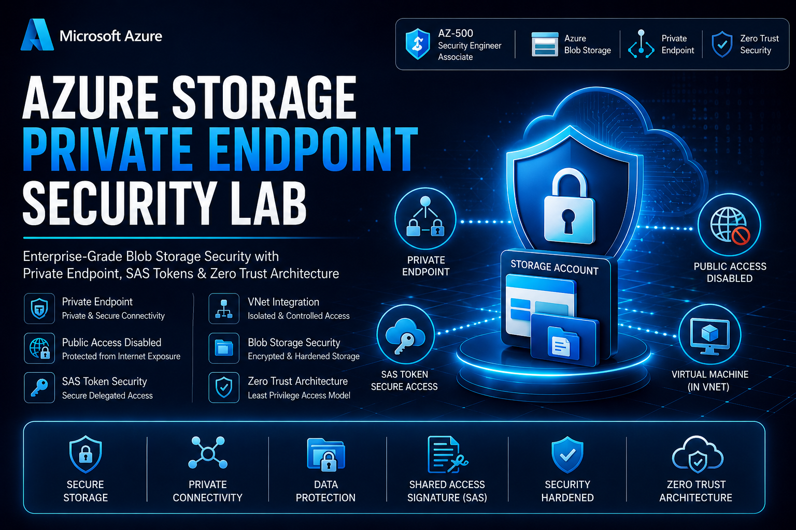

<h1 align="center">🔐 Azure Storage Private Endpoint Security Lab</h1>

<h3 align="center">
Enterprise-Grade Azure Blob Storage Hardening with Private Endpoint, SAS Tokens & Zero Trust Security
</h3>

---

# 📌 Project Overview

This lab demonstrates how to secure Azure Blob Storage using enterprise-grade Zero Trust security principles.

The objective of this implementation was to:

- Deploy secure Azure Blob Storage
- Disable anonymous public access
- Implement Private Endpoint connectivity
- Restrict storage access through Virtual Network isolation
- Configure secure file sharing using SAS Tokens
- Validate secure blob upload and access workflows

This project simulates how organizations secure sensitive cloud storage workloads in production Azure environments.

---

# 🏗️ Architecture Flow

  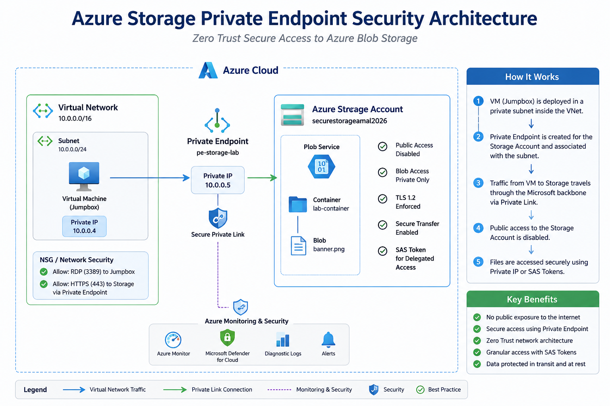

---

# ☁️ Technologies Used

| Technology | Purpose |
|---|---|
| Azure Blob Storage | Secure object storage |
| Azure Private Endpoint | Private connectivity |
| Azure Virtual Network | Network isolation |
| Azure SAS Tokens | Secure delegated access |
| Azure Virtual Machine | Internal access testing |
| Azure Storage Containers | Blob organization |
| TLS 1.2 | Secure encrypted communication |

---

# 🔐 Security Features Implemented

✅ Public Blob Access Disabled  
✅ Private Endpoint Integration  
✅ Secure VNet Isolation  
✅ Shared Access Signature (SAS) Security  
✅ Secure Blob Upload Validation  
✅ Azure Storage Hardening  
✅ Zero Trust Access Model  

---

# 🖼️ Lab Deployment Screenshots

---

## 1️⃣ Azure Storage Account Deployment

  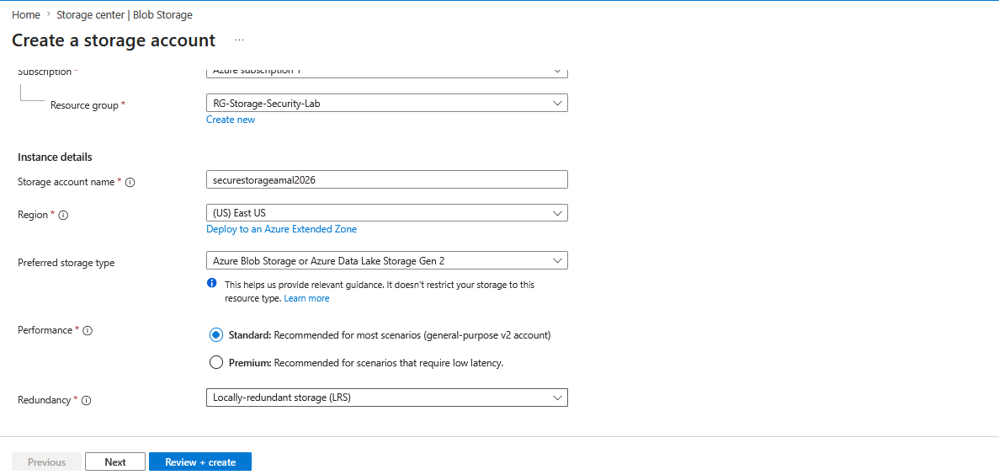

---

## 2️⃣ Virtual Network Deployment

  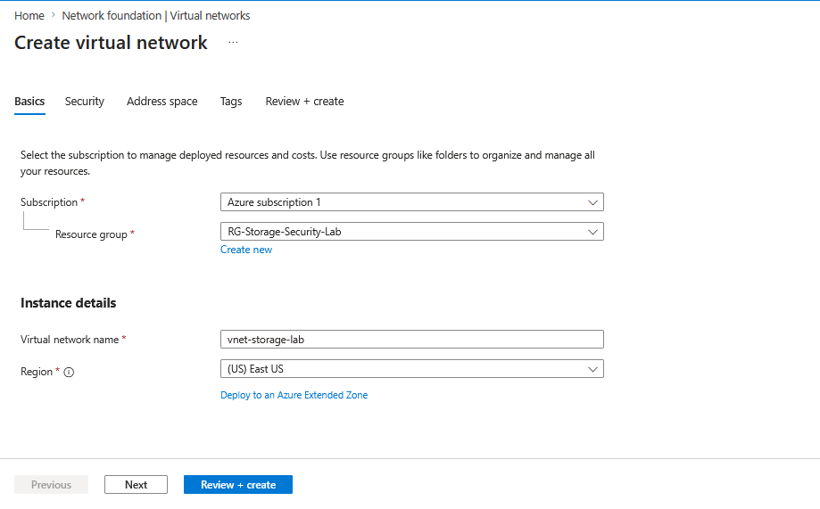

---

## 3️⃣ Azure Virtual Machine Configuration

  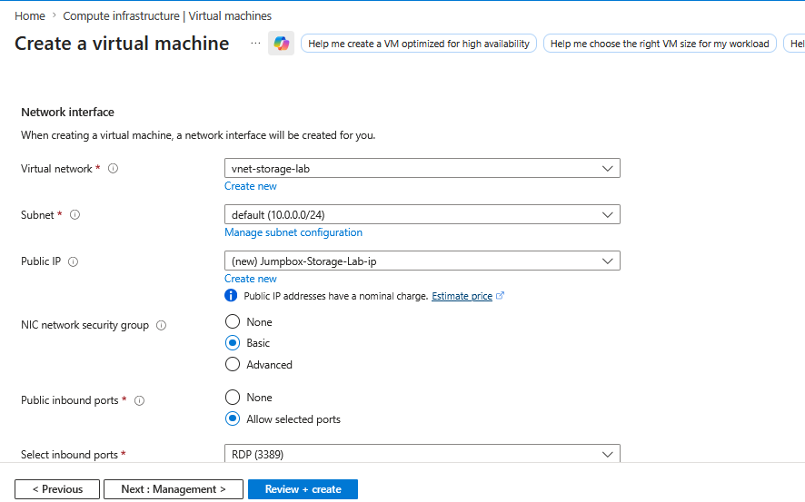

---

## 4️⃣ Private Endpoint Deployment

  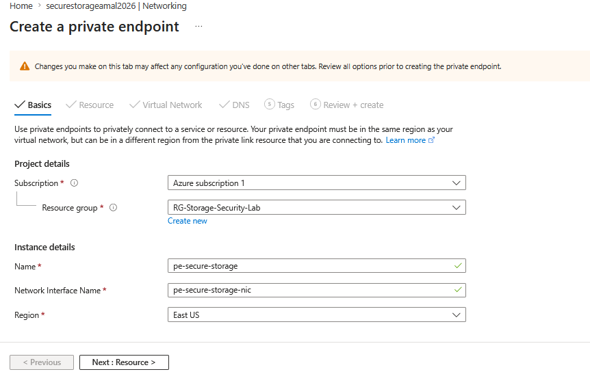

---

## 5️⃣ Secure Storage Container Creation

  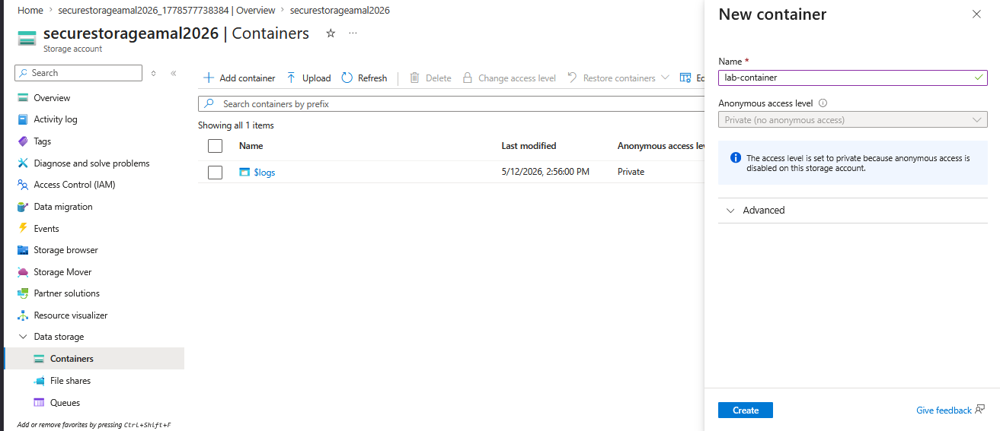

---

## 6️⃣ Blob Upload Validation

  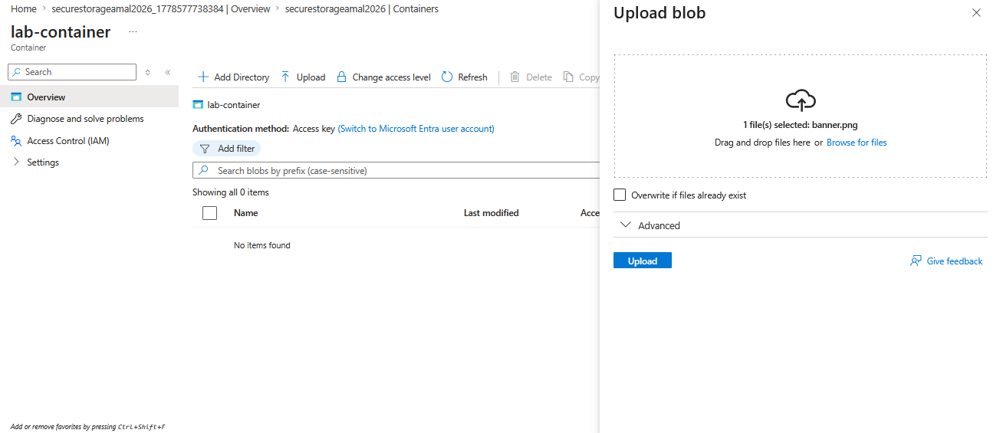

---

## 7️⃣ Shared Access Signature (SAS) Configuration

  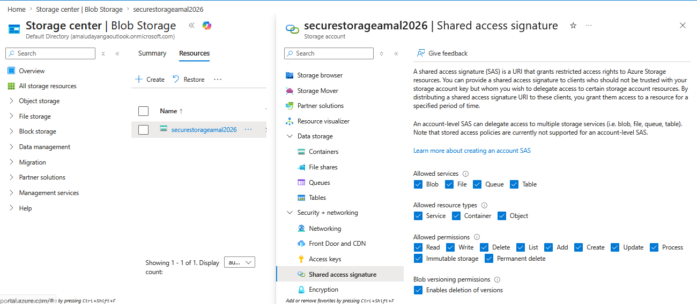

---

## 8️⃣ Storage Security Configuration Overview

  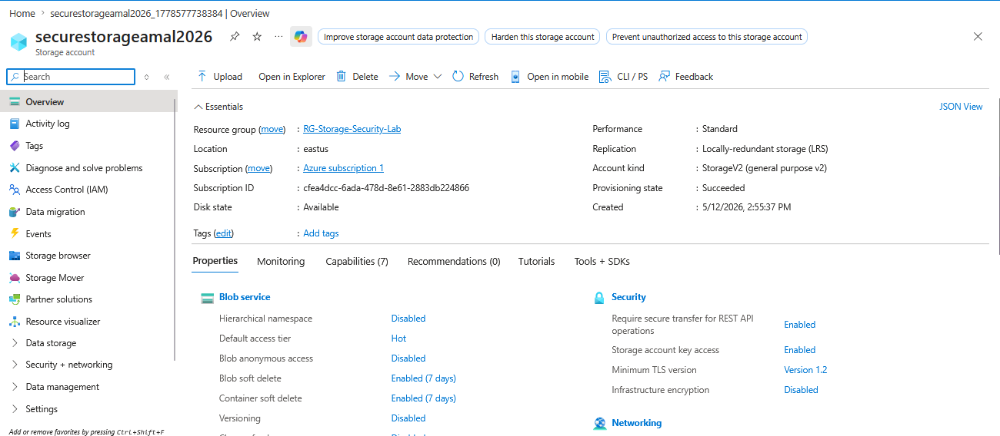

---

## 9️⃣ Public Access Restriction Validation

  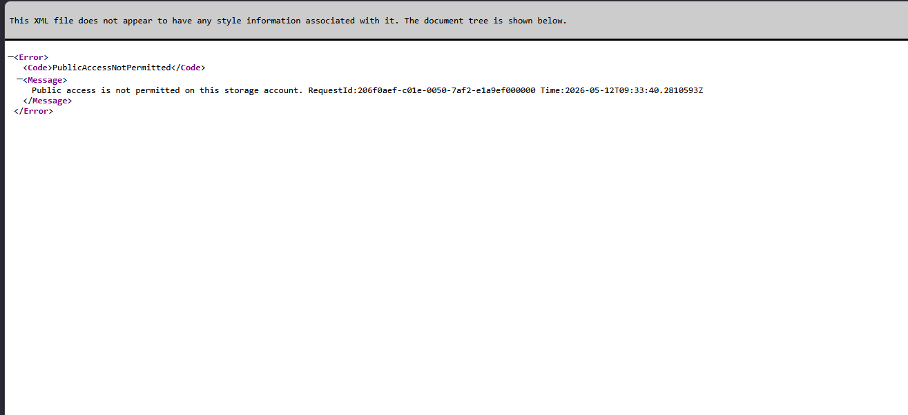

---

## 🔟 Successful Secure Blob Access Verification

  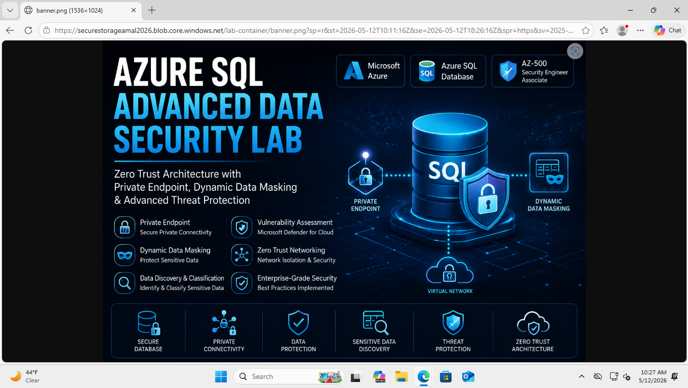

---

# 🛡️ Key Security Concepts Practiced

| Concept | Coverage |
|---|---|
| Azure Blob Storage Security | ✅ |
| Azure Private Endpoint | ✅ |
| Zero Trust Security | ✅ |
| Shared Access Signatures (SAS) | ✅ |
| Network Isolation | ✅ |
| Secure Storage Architecture | ✅ |
| Secure File Sharing | ✅ |
| Azure Storage Hardening | ✅ |

---

# 🎯 Skills Demonstrated

- Azure Storage Security
- Azure Networking
- Private Endpoint Deployment
- Azure Blob Storage Administration
- Zero Trust Cloud Architecture
- SAS Token Management
- Secure Cloud Resource Isolation
- Cloud Security Hardening

---

# 🚀 Business Impact

This implementation demonstrates how organizations can:

- Protect sensitive storage resources from public internet exposure
- Enforce private-only cloud storage access
- Implement secure delegated access using SAS Tokens
- Reduce attack surface using Zero Trust security controls
- Harden Azure storage infrastructure against unauthorized access

---

# 👨‍💻 Author

## Amal Udayanga Basnayake

🔗 LinkedIn:
https://linkedin.com/in/amal-udayanga-basnayake

🔗 GitHub:
https://github.com/AmalUBasnayake

🔗 Portfolio:
https://amalcyberlab.vercel.app

🔗 Medium:
https://medium.com/@amalubasnayake

---

# ⭐ Repository Purpose

This repository was built as part of my:

- AZ-500 Azure Security Engineer preparation
- Azure cloud security engineering practice
- Zero Trust architecture learning journey
- Enterprise-grade cloud security portfolio
